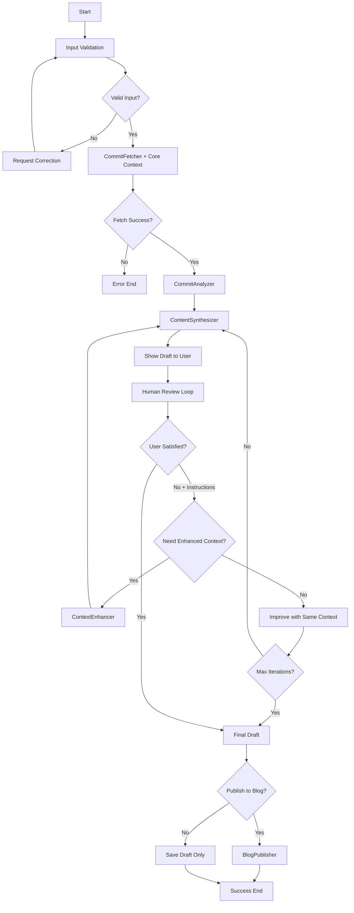

# BlueStar LangGraph Architecture

**AI-Powered Developer Blog Generation Agent**  
*LangGraph Workflow Design & Implementation Guide*

---

## Overview

BlueStar uses LangGraph to orchestrate an AI-powered workflow that transforms Git commits into high-quality developer blog posts. It is designed as a standalone local application to provide a rich, interactive experience. The architecture emphasizes user control, iterative improvement, and flexible publishing options.

**Core Workflow**: 
```
Input Validation → Commit Fetching → Analysis → Content Generation → 
Human Review Loop → Publishing Decision → Optional Blog Publishing
```

---

## Architecture Diagram



---

## Node Overview

### 1. InputValidator Node
**Purpose**: Validate structured input data  
**Components**: Repository validation, commit SHA validation, normalization  
**Output**: Validated and normalized input data

### 2. CommitFetcher + Core Context Tool ⭐ **ENHANCED**
**Purpose**: Retrieve commit data from GitHub API with baseline contextual information  
**Components**: 
- GitHubClient + CommitDataParser integration
- **NEW**: Repository metadata fetching (description, language, topics)
- **NEW**: README summary extraction (first 1000 chars)
- **NEW**: Primary configuration file analysis (package.json, pyproject.toml, etc.)
- **NEW**: Project type detection and framework identification
**Output**: Structured CommitData object with enhanced project_structure field
**Token Cost**: ~1,000-3,000 tokens for core context

### 3. CommitAnalyzer Node ✅ **COMPLETE**
**Purpose**: LLM-powered analysis of commit data with core context  
**Components**: LLM processing with enhanced project context, structured analysis extraction  
**Output**: CommitAnalysis with categorization, insights, and context completeness scoring
**Status**: ✅ Full implementation with comprehensive testing (32 unit + 4 integration tests), LangSmith tracing, and production-ready error handling

### 4. ContentSynthesizer Node ✅ **COMPLETE** 
**Purpose**: Generate a structured, platform-agnostic blog post from analysis.
**Components**: 
- LLM generation with refined, engineer-to-engineer prompting.
- Injects JSON schema to ensure reliable, structured output.
- Produces a high-quality `BlogPostOutput` object with typed content blocks (paragraphs, code, etc.).
**Status**: ✅ Full implementation with comprehensive testing and iterative prompt refinement.

### 5. HumanReviewLoop Node ⭐ **ENHANCED**
**Purpose**: Manage iterative improvement with intelligent context enhancement routing  
**Components**: 
- Draft display and satisfaction collection
- **NEW**: Context enhancement decision logic
- **NEW**: Routing to ContextEnhancer vs direct content improvement
**Output**: User satisfaction status, improvement instructions, and enhancement routing decision

### 6. ContextEnhancer Node ⭐ **NEW**
**Purpose**: Intelligently fetch additional context based on user feedback and quality gaps  
**Components**:
- LLM-powered context need assessment
- Selective GitHub API data fetching (PR context, recent commits, directory structure)
- Context relevance filtering and token optimization
**Input**: Current blog post, user feedback, commit data, core context
**Output**: Enhanced context data integrated into CommitData.project_structure
**Token Cost**: ~500-2,000 tokens for enhanced context
**Triggers**: User dissatisfaction + LLM assessment of context value

### 7. PublishingDecision Node
**Purpose**: Handle publishing choice and draft saving  
**Components**: User choice collection, local draft saving  
**Output**: Publishing decision and draft preservation

### 8. BlogPublisher Tool *(Phase 2)*
**Purpose**: Publish to Ghost CMS platform  
**Components**: 
- **NEW**: Renderer to convert structured `BlogPostOutput` to platform-specific format (e.g., HTML for Ghost).
- Ghost API integration, publishing workflow  
**Output**: Publishing result and metadata

---

## LangSmith Observability Infrastructure ✅ **COMPLETE**

### LangSmith Tracing Setup (`src/bluestar/core/tracing.py`)
**Purpose**: Production observability and debugging for LLM interactions  
**Components**:
- **Global Configuration**: Environment-based setup following LangSmith documentation
- **Multi-LLM Support**: Works with Claude/Gemini (not just OpenAI) via LANGSMITH_API_KEY  
- **Automatic Integration**: LangChain's built-in tracing without custom wrapper complexity
- **Project Management**: Configurable project names (bluestar-default, bluestar-integration-tests)
- **Auto-initialization**: Automatic setup for main application with pytest detection

**Status**: ✅ Complete with verified tracing in production CommitAnalyzer node and integration tests

---

## AgentState Summary

### Input Data
- **repo_identifier**: Repository identifier (owner/repo format)
- **commit_sha**: Validated commit SHA (40 characters)
- **user_instructions**: Optional user instructions as string

### Processing Data
- **commit_data**: Structured commit information from GitHub API **with core context**
- **commit_analysis**: LLM analysis results with categorization, insights, **and context completeness scoring**
- **blog_post**: Generated blog post as a structured, platform-agnostic `BlogPostOutput` object.
- **enhanced_context**: ⭐ **NEW** Additional context fetched during enhancement phase (optional)

### Human-in-the-Loop Control
- **max_iterations**: Maximum allowed iterations (default: 3)
- **user_satisfied**: User satisfaction with current draft (Boolean: feedback presence indicates dissatisfaction)
- **needs_context_enhancement**: ⭐ **NEW** Flag indicating whether context enhancement is needed
- **context_enhancement_attempted**: ⭐ **NEW** Track if enhancement has been tried (prevent loops)

### Workflow Control
- **current_step**: Current workflow step identifier
- **processing_complete**: Workflow completion flag
- **errors**: Error messages encountered during execution

### Publishing Control
- **publish_to_blog**: User choice for publishing vs draft-only
- **publication_result**: Publishing operation results and metadata

### Metadata
- **workflow_id**: Unique workflow identifier
- **start_time**: Workflow initiation timestamp
- **step_timestamps**: Completion time for each step
- **context_fetch_stats**: ⭐ **NEW** Token usage and API call tracking for context operations

---

## Design Questions to Review

### AgentState Design Questions

#### Input Data Management ✅ **RESOLVED**
1. **Raw vs Parsed Storage**: Should we store both original and processed input for debugging?  
   **Decision**: **Store structured data only - no raw input storage**
   - AgentState accepts structured data directly (`repo_identifier`, `commit_sha`, `user_instructions`)
   - Interface layers (CLI, Web UI) handle their own parsing before creating AgentState
   - **Benefits**: Clean separation of concerns + optimal data format for each interface type

2. **Validation History Granularity**: How detailed should validation step tracking be?  
   **Decision**: **No validation history tracking - use simple error messages**
   - Validation results handled by function return values and state.errors
   - **Benefits**: Simpler implementation, no unused data storage
   - **Rationale**: LangGraph and LangSmith already provide debugging capabilities

3. **Instruction Processing**: Should user instructions be parsed into categories or kept as free-form text?  
   **Decision**: **LLM-based parsing with structured extraction + prompt enhancement**
   - Use LLM to extract structured categories from natural language instructions
   - Generate optimized prompt additions for content generation
   - **Benefits**: Natural language freedom + systematic application + optimized generation

#### Processing Data Tracking ✅ **RESOLVED**
4. **Intermediate State Storage**: Do we need to preserve intermediate LLM responses?  
   **Decision**: **No, don't preserve intermediate LLM responses**
   - LangSmith handles debugging and tracing
   - Would cause state bloat and memory overhead
   - No clear value beyond debugging (already covered)
   - **Benefits**: Simpler state, better performance

5. **Data Versioning**: Should we track changes across iterations?  
   **Decision**: **Use prompt design instead of state tracking**
   - Generate posts that explain improvements made
   - Embed change explanations directly in content
   - User sees changes transparently without complex state management
   - **Benefits**: Better UX, no version tracking complexity

6. **Processing Timestamps**: What level of timing data should we capture?  
   **Decision**: **Minimal timing for MVP - basic step timestamps only**
   - Track step completion times and total workflow duration
   - Purpose: Performance monitoring and user progress indication
   - Detailed timing (LLM call durations, iteration analysis) can be added later
   - **Benefits**: Simple implementation, covers essential monitoring needs

#### Human-in-the-Loop Management ✅ **RESOLVED**
7. **Feedback Structure**: Simple strings vs categorized feedback objects?  
   **Decision**: **Use simple natural language strings for user feedback**
   - LLMs excel at parsing natural language intent without explicit categorization
   - Simpler implementation with better UX than forcing users into predefined categories
   - Fewer edge cases and classification errors
   - **Benefits**: Natural user expression + efficient LLM processing

8. **Satisfaction Measurement**: Boolean satisfaction vs scored ratings?  
   **Decision**: **Use feedback presence as boolean satisfaction indicator**
   - Asking for improvement inherently signals dissatisfaction (user_satisfied = False)
   - No improvement request means satisfied (user_satisfied = True)  
   - Eliminates artificial rating scales and reduces interaction friction
   - **Benefits**: More natural UX + single interaction instead of separate rating + feedback

9. **Iteration History**: Should we track what changed in each iteration?  
   **Decision**: **No manual iteration tracking needed - rely on LangGraph checkpointing**
   - LangGraph automatically preserves complete conversation history via checkpointers
   - Previous feedback naturally available in message context for each node execution
   - Eliminates redundant state management and potential synchronization issues
   - **Benefits**: Simpler AgentState + automatic context preservation + LangGraph-native approach

#### Error Handling Approach ✅ **RESOLVED**
10. **Error Granularity**: Simple error strings vs structured error objects?  
    **Decision**: **Use existing BlueStar exception hierarchy + simple error messages in AgentState**
    - Comprehensive exception system already exists in `src/bluestar/core/exceptions.py`
    - Tools handle their own errors with structured exceptions (ConfigurationError, RepositoryError, LLMError, etc.)
    - AgentState includes simple `errors: List[str]` for user-facing workflow messages
    - **Benefits**: Reuse robust existing system + avoid duplication + clear user communication

11. **Recovery Strategy**: Should errors include recovery suggestions?  
    **Decision**: **Terminate workflow with clear user guidance (no complex recovery)**
    - Most errors should terminate workflow execution with helpful error messages
    - Existing exceptions already include user guidance ("Check GITHUB_TOKEN", "Repository not found")
    - No automatic retry logic at LangGraph level (tools already handle appropriate retries)
    - **Benefits**: Simple workflow behavior + clear user feedback + no complex state recovery

12. **Error Categorization**: Do we need error types (network, validation, LLM, user)?  
    **Decision**: **Use existing BlueStar exception categories (no additional types needed)**
    - Existing hierarchy already provides proper categorization by domain
    - Tools map errors correctly (HTTP 404 → RepositoryError, API failures → LLMError)
    - LangGraph level focuses on workflow orchestration errors, not tool-level categorization
    - **Benefits**: Consistent error handling + no redundant categorization + domain-appropriate exception types

#### Workflow Control Strategy ✅ **RESOLVED**
13. **Progress Tracking**: Simple step tracking vs detailed execution history?  
    **Decision**: **User-facing progress display via LangGraph native events (no AgentState storage)**
    - Show current step to users ("🔄 Analyzing commit...", "✅ Content generated")
    - Use LangGraph's streaming/events system instead of storing progress in state
    - LangSmith handles detailed execution history for debugging purposes
    - **Benefits**: Transient display info stays out of business logic state + leverages LangGraph capabilities

14. **Resumption Capability**: Should workflows be resumable after interruption?  
    **Decision**: **No resumption capability for MVP (focus on core features first)**
    - Users restart workflow from beginning if interrupted
    - May revisit in future phases after core functionality is stable
    - **Benefits**: Simpler implementation + reduced complexity + focus on core workflow quality

15. **Performance Metrics**: What execution metrics should we capture?  
    **Decision**: **Separate metrics system for quality improvement (see performance_metrics document)**
    - Critical for improving blog post generation quality
    - Separate implementation from core workflow
    - Focus on content quality measurement and user experience optimization

### Node-Specific Design Questions

#### InputCollector Node
16. **Input Validation Strategy**: Progressive validation vs batch validation?
17. **Error Recovery**: How should validation failures be handled?
18. **User Guidance**: What level of input format guidance should we provide?

#### CommitAnalyzer Node
19. **Analysis Depth**: What level of commit analysis detail is optimal?
20. **Analysis Consistency**: How do we ensure consistent analysis quality?
21. **Context Integration**: Should analysis include repository context beyond the commit?

#### ContentSynthesizer Node
22. **Generation Strategy**: Single comprehensive generation vs iterative building?
23. **Template Usage**: Should we support predefined blog post templates?
24. **SEO Optimization**: What level of automated SEO enhancement should we include?

#### HumanReviewLoop Node
25. **User Interface**: How should drafts be presented to users?
26. **Feedback Processing**: How should user feedback be interpreted and applied?
27. **Iteration Limits**: How should maximum iteration enforcement work?

### System-Wide Design Questions

#### Configuration Management
28. **State vs Configuration**: What settings belong in workflow state vs global configuration?
29. **User Preferences**: Should user preferences persist across sessions?
30. **Default Values**: How should system defaults be managed and customized?

#### Performance Considerations
31. **State Size Impact**: How does state complexity affect LangGraph performance?
32. **Memory Management**: Should we implement state cleanup or compression?
33. **Processing Efficiency**: What optimizations are needed for production use?

#### Integration Strategy
34. **Component Reuse**: How should existing components be integrated into nodes?
35. **Tool Interfaces**: What level of abstraction should tools provide?
36. **Error Propagation**: How should errors flow between components?

#### Interface Design ✅ **RESOLVED**
37. **Input Format Strategy**: How should different interfaces (CLI, Web UI) provide input data?  
    **Decision**: **Interface-specific parsing with structured AgentState creation**
    - CLI: Parses text input ("repo sha | instructions") → structured AgentState
    - Web UI (Future): Form/API data → structured AgentState
    - **Benefits**: Natural data formats for each interface + no forced string conversion

38. **State Initialization**: Should AgentState accept raw strings or structured data?  
    **Decision**: **Structured data only in AgentState constructor**
    - AgentState(repo_identifier, commit_sha, user_instructions) - no raw_input field
    - Input Validator validates structured data instead of parsing strings
    - **Benefits**: Type safety + cleaner architecture + optimal for future UI or API interfaces

#### Future Extensibility
39. **Multi-Commit Support**: How should the architecture scale to multiple commits?
40. **Platform Integration**: How should multiple blog platforms be supported?
41. **Packaging**: What modifications are needed for distribution as a standalone CLI tool?


---

## Implementation Phases

### Phase 1: Core MVP ⭐ **ENHANCED**
- Input collection and validation
- **Enhanced CommitFetcher** with core context (repo metadata, README, config files)
- ✅ **Context-aware CommitAnalyzer** with completeness scoring - **COMPLETE**
- **Baseline ContentSynthesizer** with core context integration
- Human review loop with basic iteration limits
- Draft output (no publishing)

### Phase 1.5: Progressive Context Enhancement ⭐ **NEW**
- **ContextEnhancer node** implementation
- **Enhanced HumanReviewLoop** with context enhancement routing
- **LLM-powered context need assessment** with decision criteria
- **Selective GitHub API integration** for enhanced context (PR, commits, structure)
- **Regeneration workflow** with enhanced context

### Phase 2: Publishing Integration
- BlogPublisher tool for Ghost CMS
- Publishing error handling and retry logic
- Publishing success confirmation

### Phase 3: Advanced Features
- Multi-commit support with progressive context
- Self-RAG quality validation integrated with context enhancement
- Advanced user interaction patterns
- **Context optimization** and caching strategies

---

*This architecture serves as the foundation for BlueStar's LangGraph implementation, emphasizing user control, quality iteration, and flexible publishing workflows.*
