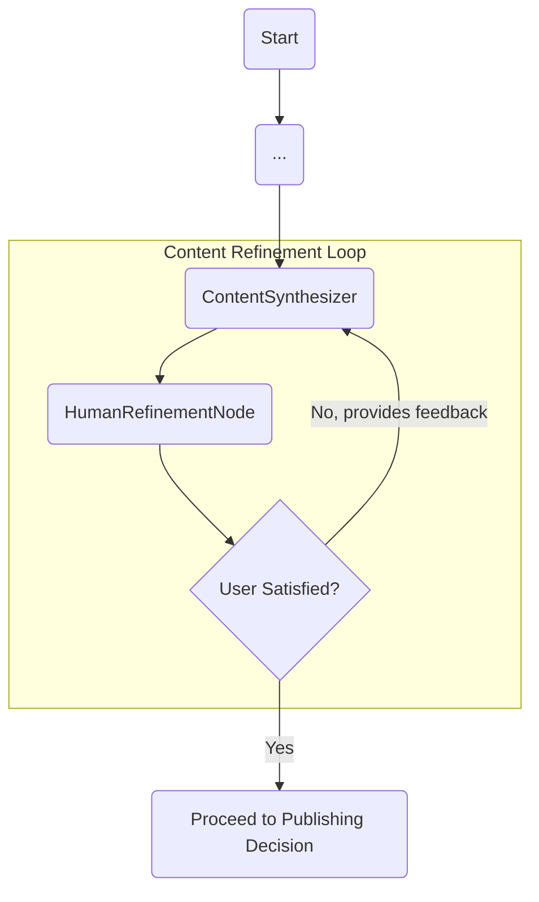

# BlueStar: Human-in-the-Loop (HIL) Refinement Workflow

**AI-Powered Developer Blog Generation Agent**  
*Design for Interactive Content Improvement*

---

## 1. Overview

This document outlines the architecture and workflow for BlueStar's **Content Refinement Loop**. This is the first of two Human-in-the-Loop (HIL) interaction points in the application. Its primary purpose is to give the user complete control over the creative quality of the generated blog post, allowing for iterative improvements before the content is considered final.

The design emphasizes a clear, explicit, and user-friendly command-line interaction.

---

## 2. Core Components

### a. `HumanRefinementNode`

This is a new, synchronous node that acts as the primary user interaction point for content refinement.

**Responsibilities:**

1.  **Present the Draft**: The node will access the `BlogPostOutput` from the `AgentState`. To present the draft in a clean, readable format in the terminal, it will:
    *   First, convert the list of structured `ContentBlock` objects (paragraphs, headings, code blocks) into a single, well-formed Markdown string.
    *   Then, use the `rich` library to render this Markdown string to the console. This will ensure that headings, lists, and code blocks (with syntax highlighting) are displayed beautifully and correctly.

2.  **Ask for Satisfaction (Question 1)**: It will ask a direct, closed-ended question to explicitly gauge user satisfaction.
    ```
    Are you satisfied with this draft? (y/n): 
    ```

3.  **Ask for Feedback (Question 2 - Conditional)**: If and only if the user expresses dissatisfaction (e.g., by answering "n"), the node will ask a second, open-ended question to gather specific instructions for improvement.
    ```
    What would you like me to change?: 
    ```

4.  **Update State**: The node is responsible for updating the `AgentState` based on the user's answers.
    *   **If Satisfied**: It sets `user_satisfied = True` and `user_feedback = None`.
    *   **If Not Satisfied**: It sets `user_satisfied = False` and populates `user_feedback` with the user's refinement instructions.

### b. `AgentState` Fields

The loop is controlled by the following fields in the `AgentState`:

*   `user_satisfied: Optional[bool]`: Acts as the primary flag to exit the loop.
*   `user_feedback: Optional[str]`: Stores the user's instructions for the `ContentSynthesizer` to use in the next iteration.
*   `synthesis_iteration_count: int`: Tracks the number of refinement cycles to prevent infinite loops.

### c. Graph Conditional Edge

The "loop" is implemented as a conditional edge in the main graph, controlled by a routing function.

*   **Routing Function (`should_refine_content`)**: This function inspects the `AgentState` after the `HumanRefinementNode` has run.
    *   It first checks `synthesis_iteration_count` against `max_iterations` to enforce an exit condition.
    *   It then checks `user_satisfied`.
*   **Routing Logic**:
    *   If the user is **not satisfied**, the graph routes execution back to the `ContentSynthesizer` node.
    *   If the user **is satisfied** (or max iterations are met), the graph proceeds forward to the `PublishingDecisionNode`.

---

## 3. Workflow Diagram

This diagram illustrates the flow of the Content Refinement Loop.



---

## 4. Example CLI Interaction

```
(Bluestar Agent)
...
Title: Building a Better Workflow: Introducing the ContentSynthesizer
Summary: In our latest update, we've introduced a new ContentSynthesizer node designed to streamline the process of turning technical analysis into polished blog posts. This component leverages...

(Bluestar Agent)
Are you satisfied with this draft? (y/n): n

(Bluestar Agent)
What would you like me to change?: Make the tone more technical and add a code example for the main LLM chain.

(Bluestar Agent)
Understood. Refining the draft based on your feedback...
[Graph loops back to ContentSynthesizer]
...
```
