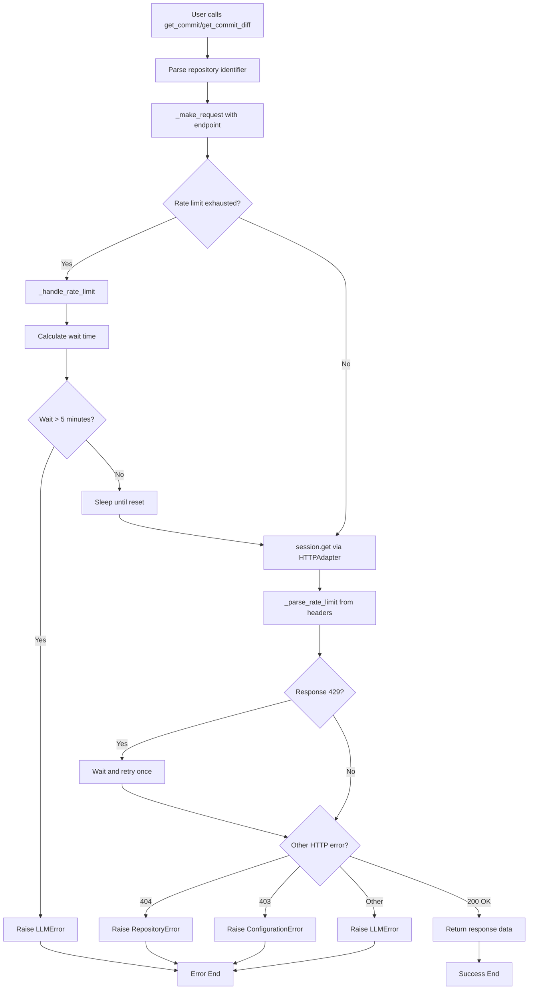

# GitHubClient Module Documentation

**BlueStar GitHub API Integration**

---

## Overview

The `GitHubClient` module provides robust, production-ready GitHub API integration for BlueStar's commit data retrieval. It handles authentication, rate limiting, connection management, and error handling automatically.

## Architecture Components

### Core Classes

#### `GitHubRateLimit` (@dataclass)
```python
@dataclass
class GitHubRateLimit:
    limit: int           # API requests per hour (5000 for authenticated)
    remaining: int       # Requests left in current window
    reset_time: datetime # When the limit resets
```

**Purpose**: Track GitHub API quota to prevent 429 errors proactively
- `is_exhausted` property: True when remaining <= 0
- `reset_in_seconds` property: Calculates wait time until reset

#### `GitHubClient`
Main client class that orchestrates all GitHub API interactions.

**Key Attributes**:
- `token`: GitHub personal access token
- `base_url`: GitHub API base URL (https://api.github.com)
- `session`: Configured requests.Session with retry logic
- `_rate_limit`: Current rate limit status (Optional[GitHubRateLimit])

## Request Flow Diagram



## Detailed Component Flow

### 1. Initialization Phase (One-time Setup)

```python
client = GitHubClient(token="ghp_abc123")
```

**Component Activation:**
1. **Token Validation**: Check env var `GITHUB_TOKEN` or use provided token
2. **Session Creation**: `_create_session()` configures:
   - **Retry Strategy**: 3 attempts, exponential backoff, specific error codes
   - **HTTPAdapter**: Connection pooling and protocol handling
   - **Headers**: Authorization, Accept (JSON), User-Agent
3. **Rate Limit**: Initialize as `None` (updated after first request)

### 2. Request Execution Phase

```python
commit_data = client.get_commit("microsoft", "vscode", "abc123")
```

#### Step 2.1: Repository Parsing
```python
# For flexible input handling
owner, repo = GitHubClient.parse_repo_identifier(repo_input)
```

**Handles formats:**
- `"microsoft/vscode"`
- `"https://github.com/microsoft/vscode"`
- `"https://github.com/microsoft/vscode.git"`
- `"github.com/microsoft/vscode"`

#### Step 2.2: Proactive Rate Limit Check
```python
if self._rate_limit and self._rate_limit.is_exhausted:
    self._handle_rate_limit(self._rate_limit)
```

**Rate Limit Handler Logic:**
- Calculate exact wait time: `reset_in_seconds + 1`
- Check reasonable bounds: Don't wait > 5 minutes
- Sleep until reset or raise `LLMError`

#### Step 2.3: HTTP Request via Session
```python
response = self.session.get(url, timeout=30)
```

**Session Components:**
- **HTTPAdapter**: Connection pooling, HTTPS handling, retry execution
- **Headers**: Persistent auth, accept, user-agent
- **Timeout**: 30-second request timeout

#### Step 2.4: Rate Limit Update
```python
self._rate_limit = self._parse_rate_limit(response)
```

**Extracts from headers:**
- `X-RateLimit-Limit`: Total quota (5000)
- `X-RateLimit-Remaining`: Requests left
- `X-RateLimit-Reset`: Unix timestamp of reset

#### Step 2.5: Response Processing
```python
# Handle reactive rate limiting
if response.status_code == 429:
    self._handle_rate_limit(self._rate_limit)
    response = self.session.get(url, timeout=30)  # Retry once

# Error mapping
response.raise_for_status()
return response.json()  # or response.text for diffs
```

### 3. Error Handling Flow

**HTTP Status → BlueStar Exception Mapping:**

| HTTP Code | BlueStar Exception | Meaning |
|-----------|-------------------|---------|
| 404 | `RepositoryError` | Repo/commit not found |
| 403 | `ConfigurationError` | Token invalid/insufficient permissions |
| 429 | Auto-handled | Rate limit (wait and retry) |
| 5xx | `LLMError` | GitHub server issues |
| Timeout | `LLMError` | Network timeout |

## API Methods

### `get_commit(owner, repo, sha) -> Dict[str, Any]`
**Purpose**: Fetch commit metadata in JSON format

**Returns**: GitHub API commit object with:
- Commit message, author, date
- File change statistics
- Modified file list

### `get_commit_diff(owner, repo, sha) -> str`
**Purpose**: Fetch commit diff in unified diff format

**Special handling**:
- Temporarily overrides `Accept` header to `application/vnd.github.v3.diff`
- Returns raw text diff content
- Preserves session's default JSON Accept header

### `parse_repo_identifier(repo_identifier) -> Tuple[str, str]`
**Purpose**: Normalize repository identifiers to (owner, repo) tuple

**Static method** - no instance required

## Performance Characteristics

### Connection Reuse
- **HTTPAdapter** pools connections per host
- Subsequent requests to same API avoid TCP/TLS handshake
- ~7x faster for multiple requests

### Rate Limit Management
- **Proactive**: Check before requests (prevent 429)
- **Reactive**: Handle 429 responses (wait and retry)
- **Smart timing**: Wait exactly until reset + 1 second buffer

### Retry Strategy
- **Network resilience**: Auto-retry on temporary failures
- **Exponential backoff**: 1s, 2s, 4s wait times
- **Selective retries**: Only retry appropriate errors (429, 5xx)

## Configuration

### Environment Variables
```bash
# Required
GITHUB_TOKEN=ghp_abc123...

# Optional (defaults shown)
# GitHub API base URL is hardcoded to https://api.github.com
```

### Rate Limits
- **Authenticated**: 5,000 requests/hour
- **Reset**: Top of each hour (e.g., 2:00 PM, 3:00 PM)
- **Headers**: GitHub provides real-time limit info

## Usage Examples

### Basic Usage
```python
# Initialize client
client = GitHubClient()  # Uses GITHUB_TOKEN env var

# Fetch commit data
commit = client.get_commit("microsoft", "vscode", "abc123")
diff = client.get_commit_diff("microsoft", "vscode", "abc123")

# Check rate limit status
if client.rate_limit_info:
    print(f"Requests remaining: {client.rate_limit_info.remaining}")
```

### Flexible Repository Input
```python
# All these work:
owner, repo = GitHubClient.parse_repo_identifier("microsoft/vscode")
owner, repo = GitHubClient.parse_repo_identifier("https://github.com/microsoft/vscode")
owner, repo = GitHubClient.parse_repo_identifier("https://github.com/microsoft/vscode.git")
```

### Error Handling
```python
try:
    commit = client.get_commit("owner", "repo", "invalid_sha")
except RepositoryError:
    print("Repository or commit not found")
except ConfigurationError:
    print("GitHub token invalid or insufficient permissions")
except LLMError as e:
    print(f"API error: {e}")
```

## Integration Points

### With CommitFetcher
```python
class CommitFetcher:
    def __init__(self):
        self.github_client = GitHubClient()
    
    def fetch_commit_data(self, repo_identifier: str, sha: str) -> CommitData:
        owner, repo = GitHubClient.parse_repo_identifier(repo_identifier)
        commit_response = self.github_client.get_commit(owner, repo, sha)
        diff_content = self.github_client.get_commit_diff(owner, repo, sha)
        return CommitDataParser.parse_commit_data(commit_response, diff_content, f"{owner}/{repo}")
```

### With LangGraph/LangChain
- Designed for integration as MCP-style tool
- Handles all HTTP complexity internally
- Returns structured data for LLM processing

## Security Considerations

### Token Management
- Never logs or prints tokens
- Uses environment variables for secure storage
- Validates token presence at initialization

### Rate Limit Compliance
- Respects GitHub's rate limits automatically
- Prevents abuse through proactive management
- Implements reasonable wait time limits (5 minutes max)

### Error Information
- Maps specific errors to appropriate exception types
- Provides actionable error messages
- Avoids exposing sensitive internal details

---

## Dependencies

```python
# Standard library
import os
import time
from typing import Dict, Any, Optional, Tuple
from dataclasses import dataclass
from datetime import datetime, timezone

# Third party
import requests
from requests.adapters import HTTPAdapter
from urllib3.util.retry import Retry

# BlueStar
from ..core.exceptions import (
    InvalidCommitError, RepositoryError, 
    LLMError, ConfigurationError
)
```

---

*This documentation covers the complete GitHub API integration layer for BlueStar's commit data retrieval functionality.*
